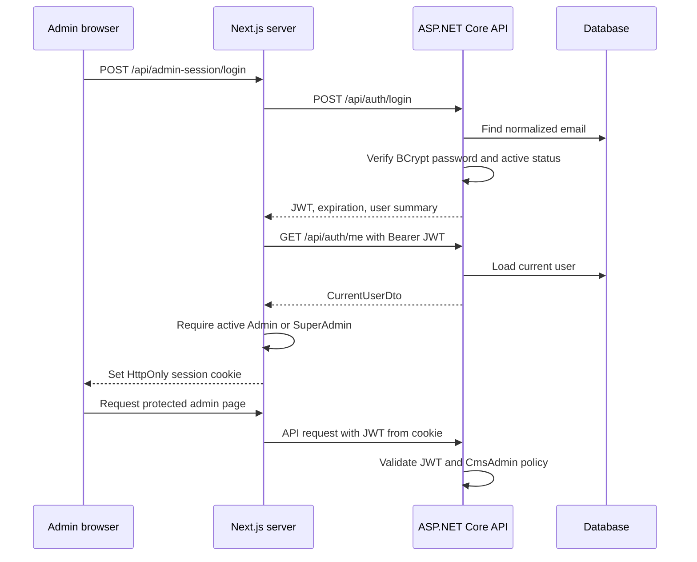

# Authentication and Authorization

Authentication establishes who a caller is. Authorization decides whether that identity may perform an action. The platform uses signed JWTs for API authentication and an ASP.NET Core policy for CMS administration.

## Login Sequence

`AuthService` normalizes email and rejects inactive users or invalid passwords with the same credential error. `JwtTokenService` signs claims for identifier, email, name, and role. `Program.cs` validates issuer, audience, lifetime, signing key, and signature, with a two-minute clock skew.

## Authorization Boundaries

The `CmsAdmin` policy requires:

1. an authenticated JWT;
2. an Admin or SuperAdmin role claim; and
3. a current database user that is still active and privileged.

The database lookup in `ActiveCmsAdminHandler` means disabling or demoting an account takes effect for admin authorization even if an older JWT still contains an admin role. Frontend route protection improves navigation and privacy, but it cannot replace this API policy.

The separate `SuperAdmin` policy does not trust the JWT role claim by itself. `ActiveSuperAdminHandler` loads the current database record and requires an active SuperAdmin, so deactivation or demotion immediately removes access-control authority. Signing in again refreshes the JWT role used by other role-aware paths after a promotion.

`401 Unauthorized` means authentication is missing or invalid. `403 Forbidden` means the caller is authenticated but lacks current permission. The web clears invalid sessions on `401` and shows `/admin/access-denied` for `403`.

## Web Session

Next.js stores the JWT in `el1te_admin_session`, an HttpOnly, SameSite Lax cookie with token-aligned expiration and Secure enabled in production. The token is never returned from the Next.js login handler and is not stored in `localStorage`. `lib/admin/server-api.ts` is server-only and translates the cookie into an API Authorization header.

HttpOnly reduces exposure to client-side JavaScript; SameSite helps limit cross-site request contexts; Secure prevents production transmission over plain HTTP. These controls do not remove the need for XSS prevention, TLS, API validation, or authorization.

Logout deletes the web cookie. The API token is stateless and is not revoked. There is currently no refresh-token, revocation, remember-me, or password-reset flow.

## Registration and Development Administration

Public registration always creates an active Parent in `AuthService`; request data cannot select a privileged role. Admin and SuperAdmin access is granted through a one-time invitation created by an active SuperAdmin. The secret is returned only at creation/reissue, stored as a SHA-256 hash, expires after 72 hours, and is accepted through a browser-fragment link so normal request URLs do not contain it. For local learning, `DevelopmentAdminSeeder` can create one SuperAdmin from User Secrets. It runs only in Development, skips incomplete configuration, and never changes an existing user. Production keeps the non-HTTP bootstrap command for initial provisioning and recovery only.

Never place signing keys, seed passwords, JWT values, or production credentials in Git, docs, logs, URLs, or screenshots.
