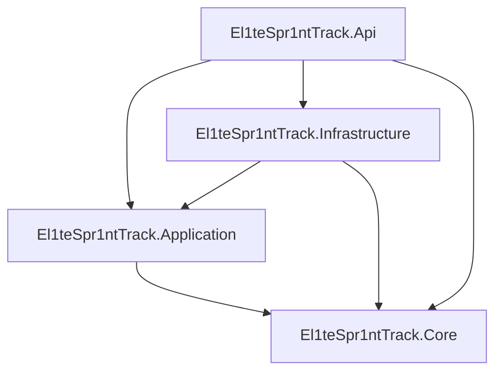

# Backend Architecture

Phase 9 keeps media metadata in SQL while image bytes live behind application-level `IMediaStorage`. `MediaService` validates lifecycle rules, `SkiaImageInspector` checks declared type, extension, encoded format, dimensions, and full decodability, and `LocalMediaStorage` owns generated path-safe keys. Controllers never write files directly.

The backend is a layered modular monolith. Its project references enforce useful separation, although some contracts and DTOs live in Core, so the documentation deliberately avoids claiming a textbook form of Clean Architecture.



## Layer Responsibilities

**Core** defines the data concepts: entities such as `Announcement` and `User`, enums such as `UserRole`, API DTOs, and foundational repository interfaces. It has no project references.

**Application** expresses use cases. `PublicCmsService`, the partial `AdminCmsService`, and `AuthService` coordinate validation and persistence through interfaces. `CmsValidationService` applies cross-entity business validation; `SlugGenerator` creates URL-safe unique candidates. Application depends on Core.

**Infrastructure** implements persistence and security details. `El1teDbContext` maps the model, repositories build EF Core queries, migrations evolve SQL Server, `JwtTokenService` creates tokens, and `DevelopmentAdminSeeder` creates an optional local SuperAdmin. Infrastructure depends on Application and Core.

**API** translates HTTP into application calls. Controllers remain thin, `GlobalExceptionMiddleware` maps known CMS exceptions to Problem Details, `CmsAdminAuthorization` enforces role and active-user requirements, and `Program.cs` wires dependencies and middleware.

## Dependency Injection

`apps/api/src/El1teSpr1ntTrack.Api/Program.cs` is the composition root. It maps service interfaces to implementations with scoped lifetimes, including `IPublicCmsService` to `PublicCmsService`, `IAdminCmsRepository` to `AdminCmsRepository`, and `IUserRepository` to `UserRepository`. Each HTTP request receives an appropriate dependency graph and EF Core context.

## Validation and Errors

- ASP.NET Core model binding handles malformed request shapes and enum conversion.
- `AuthService` validates registration and normalizes email addresses.
- `CmsValidationService` validates required CMS values and date relationships.
- Admin services throw `CmsRequestValidationException`, `CmsNotFoundException`, or `CmsConflictException`.
- `GlobalExceptionMiddleware` maps those exceptions to `400`, `404`, or `409` Problem Details and hides unexpected exception details behind `500`.

Database limits and unique indexes remain a final integrity boundary. Frontend validation improves usability but never replaces backend validation.

## Real Announcement Request Trace

```text
GET /api/admin/announcements
  -> AdminAnnouncementsController.List
  -> IAdminCmsService.GetAnnouncementsAsync
  -> AdminCmsService
  -> IAdminCmsRepository.GetAnnouncementsAsync
  -> AdminCmsRepository
  -> El1teDbContext.Announcements
  -> SQL Server
  -> AdminAnnouncementDto page
```

The controller constructs `AdminAnnouncementOptions`; the service normalizes paging; the repository applies search, published, featured, and expired filters before projection and pagination. Public requests follow `PublicCmsController` -> `PublicCmsService` -> `PublicCmsRepository`, but apply `PublicCmsVisibility.CurrentAnnouncement` so drafts, scheduled items, and expired items do not escape.

DTO projection keeps persistence entities from becoming an accidental public contract and permits public responses to omit private fields, notably coach email addresses.
