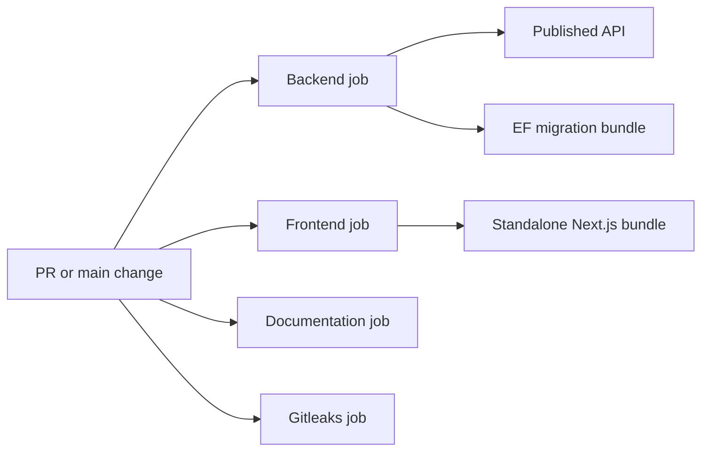

# CI/CD Overview

Continuous integration (CI) proves that a proposed repository state builds, tests, and remains internally consistent. Continuous delivery keeps a validated artifact ready for release. Continuous deployment automatically releases successful changes. This repository implements CI plus manually approved continuous delivery to the Azure `demo` Environment; it does not automatically deploy every `main` change.

## Current Flow

`.github/workflows/ci.yml` runs for relevant pull requests to `main`, pushes to `main`, and manual dispatch. One concurrency group per workflow/ref cancels obsolete CI runs.

The backend job restores from `NuGet.Config`, builds Release, runs unit and integration projects separately, checks EF model drift, publishes the API, and creates a migration bundle. Test results and successful artifacts have seven-day retention.

The frontend job uses Node 22, `npm ci`, lint, strict type checking, Vitest, and a production build. `scripts/artifacts/build-web-artifact.sh` stages the standalone server, hidden `.next` production files, static assets, and public assets. Main-only packaging verifies `.next/BUILD_ID` survives into `web.zip`.

The documentation job runs `scripts/validation/validate-docs.ps1`; the secret job uses Gitleaks locally on the GitHub runner. No repository content is sent to a separate scanning service.

PowerShell and Bash variants of artifact/smoke scripts support the Windows-first local workflow and Ubuntu GitHub runners respectively.

## Triggers and Paths

Changes under `apps`, `docs`, `infra`, `scripts`, `.github`, or shared root configuration trigger the workflow. Every CI job then runs. This deliberately favors reliability over job-level path optimization: a workflow, documentation, or infrastructure change can affect commands and deployment assumptions across the repository.

## Failure Behavior

Any nonzero command fails its job. Required branch checks cover Backend, Frontend, End-to-End, Documentation, and Secret Scan. Test result upload uses `always()` so `.trx` files remain available after a test failure. CI never updates a shared database or deploys Azure resources; only the separately approved deployment workflow can do so.

## Phase 6B

`.github/workflows/deploy-azure.yml` is a manual workflow gated by the GitHub `demo` Environment. It authenticates with OIDC, verifies a successful `main` CI run, checks out that exact SHA for Bicep, downloads the immutable release, runs what-if and infrastructure reconciliation, applies the reviewed migration bundle, deploys asynchronously, and lets long-running smoke tests verify B1 readiness. See [Azure demo deployment](future-azure-deployment.md).
