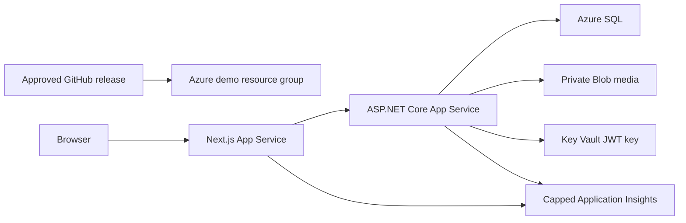

# Azure Demo Continuous Delivery

Phase 6B operates a public, search-excluded demo in Central US. East US 2 and East US did not offer the selected Azure SQL SKU during initial provisioning, so Central US is the validated fallback. The demo uses Azure hostnames and manual promotion; custom domains and automatic production deployment remain deferred.



The API system-assigned identity has Blob contributor access only on the media account, secret-read access only on the application vault, and contained-user SQL read/write access. Media remains private and is streamed through `/media/{id}`. Development continues to use `LocalMediaStorage`.

## Deployed resources

| Resource | Name |
| --- | --- |
| Resource group | `el1te-demo-central-rg` |
| Shared B1 Linux plan | `el1tesprint-demo-neauu2-plan` |
| API App Service | `el1tesprint-demo-neauu2-api` |
| Web App Service | `el1tesprint-demo-neauu2-web` |
| SQL server / database | `el1tesprint-demo-neauu2-sql` / `el1tesprint-demo-db` |
| Private media storage | `el1tesprintdemoneauu2med` |
| Key Vault | `kvel1tesprintdemoneauu2` |
| Application Insights / logs | `el1tesprint-demo-neauu2-insights` / `el1tesprint-demo-neauu2-logs` |

Both App Services allow up to 600 seconds for a B1 cold start. ZIP deployments are submitted asynchronously because Kudu can return a gateway timeout while a valid deployment continues; smoke tests are the release authority after submission.

CI creates one immutable release bundle after every successful `main` push: API ZIP, standalone web ZIP, EF bundle, manifest, and SHA-256 checksums. The manual deployment accepts a CI run ID, verifies that it is a successful `main` push, checks out the matching SHA, and promotes those artifacts without rebuilding.

The first run is infrastructure-only. An authorized SQL administrator creates the API identity as a contained user:

```sql
CREATE USER [<api-app-name>] FROM EXTERNAL PROVIDER;
ALTER ROLE db_datareader ADD MEMBER [<api-app-name>];
ALTER ROLE db_datawriter ADD MEMBER [<api-app-name>];
```

The full run opens a runner-specific SQL firewall rule, applies the reviewed migration bundle, deploys and checks the API, optionally runs the idempotent SuperAdmin bootstrap command, deploys the web app, and removes temporary SQL access in cleanup. Application rollback redeploys a retained prior artifact. Database changes are forward-only and must remain backward compatible.

Key Vault creates no committed or GitHub-held JWT key. The deployment identity initializes the secret directly in Azure when absent; the API reads it through a Key Vault reference. The workflow also configures a $125 monthly budget with 50/75/90/100 percent alerts.

The grant renewal date must be confirmed in the Microsoft for Nonprofits portal; Azure CLI does not expose it. The environment was newly provisioned on July 13-14, 2026, so a representative monthly actual cost is not yet available. Record the portal renewal date and the first complete monthly actual cost here after billing data matures.
