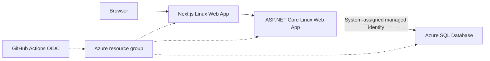

# Future Azure Deployment

No Azure resources or credentials exist as part of Phase 6A. This document describes the prepared Phase 6B target, not current infrastructure.

`infra/main.bicep` composes one Linux App Service plan, separate API/web applications, an Azure SQL logical server/database, app settings, CORS, health paths, and an API managed identity. Resource names combine a configurable prefix, environment, and deterministic suffix. B1 App Service and Basic SQL are demo-friendly defaults but are not promised to be free; Phase 6B must review current prices and grant limits.

The API connection uses `Authentication=Active Directory Default`, allowing its App Service identity to authenticate without a long-lived database password. Bicep can create the identity and database, but it cannot complete the contained database-user grant in this template. An authorized SQL administrator must later create the external user for the API identity and grant only the required read/write/schema permissions. The temporary SQL administrator and public network access exist for initial bootstrap/migration and should be removed or restricted afterward.

## Manual Deployment Template

`.github/workflows/deploy-azure.yml` has only `workflow_dispatch`, `cancel-in-progress: false`, a future `demo` environment, and a required Phase 6B acknowledgment. It fails before checkout/login if required values are absent. Its default infrastructure-only mode creates/updates resources and stops so an authorized operator can grant the new API identity SQL access. A later full run requires an explicit managed-identity-ready acknowledgment. OIDC is preferred over publish profiles or stored Azure client secrets.

Repository/environment variables:

- `AZURE_CLIENT_ID`, `AZURE_TENANT_ID`, `AZURE_SUBSCRIPTION_ID`
- `AZURE_RESOURCE_GROUP`, `AZURE_LOCATION`, `RESOURCE_NAME_PREFIX`
- `SQL_ADMIN_LOGIN`

Environment secrets:

- `SQL_ADMIN_PASSWORD` for temporary bootstrap
- `JWT_SIGNING_KEY`
- `DATABASE_MIGRATION_CONNECTION_STRING` for the reviewed bundle execution

No values are committed. A future full workflow run creates a runner-IP SQL firewall rule immediately before migration and removes it in an `always()` cleanup step. Phase 6B must still review public network policy, establish managed identity database access before API readiness is expected, and remove all temporary bootstrap access afterward.

## Artifacts and Startup

The API artifact is normal `dotnet publish` output. The web artifact is Next.js standalone output and starts with `node apps/web/server.js`. The EF bundle contains committed migrations but no credentials; execution receives a connection string at runtime. Smoke scripts verify public endpoints only.
