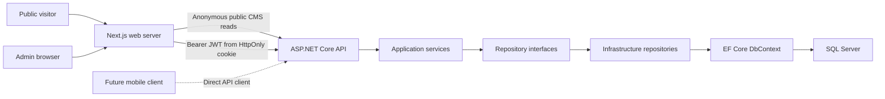

# System Overview

El1te Spr1nt Athlet1cs is the operational and public web platform for a nonprofit youth track club. Today it supplies authentication, editable CMS data, anonymous public CMS endpoints, a complete public website, protected CMS endpoints, and administration for every core CMS resource. The longer-term product may add athlete and parent workflows, registration, payments, documents, communication, and an iOS client.

## Current System

The repository is a monorepo. `apps/api` is an ASP.NET Core Web API using .NET 10, EF Core, and SQL Server. `apps/web` is a Next.js 15 App Router application using React, TypeScript, and Tailwind CSS. `docs` explains architecture and operation alongside the code.

Public callers use `/api/public` without authentication, but repository queries apply publication, activation, scheduling, expiration, and privacy rules. Administrative API routes use `/api/admin` and require the `CmsAdmin` policy. The API, not the web UI, is the final authorization authority.

The admin browser has an extra security boundary. It submits credentials to a Next.js Route Handler. Next.js signs in against the API, verifies `/api/auth/me`, and stores the JWT in an HttpOnly cookie. Browser JavaScript never receives the token. Server Components and Route Handlers forward it to the API when needed.

## Current Capabilities

- Parent registration and user login
- Current-user lookup through `/api/auth/me`
- Public CMS reads and contact-submission creation
- Protected administration endpoints for all current CMS areas
- Responsive public CMS website and real contact form
- Admin web login, dashboard, logout, and all core CMS management
- EF Core migrations and development sample CMS content
- Development-only SuperAdmin seeding through User Secrets
- Unit, integration, and frontend tests

## Boundaries and Future Clients

The API uses DTOs and JWT bearer authentication rather than Next.js-specific contracts. A future iOS client can call the same public and authenticated API routes while storing its token with platform-appropriate secure storage. It would not use the web-only HttpOnly cookie boundary.

Not built yet: password reset and token refresh, revocation, media upload, parent or athlete portals, online registration, commerce, donations, private document workflows, production deployment infrastructure, and mobile code.

Related: [backend architecture](backend-architecture.md), [frontend architecture](frontend-architecture.md), and [authentication and authorization](authentication-and-authorization.md).
