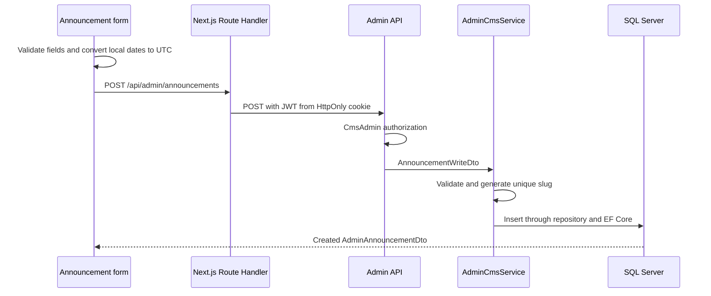

# Announcements End to End

## What Was Built

Announcements are the first complete CMS vertical slice: database model, migration, public visibility, protected CRUD API, admin list/search/filter/pagination, create/edit/delete forms, lifecycle labels, validation, and tests.

## Why It Exists

Club announcements need scheduled visibility, expiration, featured presentation, stable public URLs, and safe draft editing. The slice demonstrates how a future CMS module can cross every layer without letting persistence or authentication concerns leak into UI components.

## Important Files

- `apps/api/src/El1teSpr1ntTrack.Core/Entities/Announcement.cs`
- `apps/api/src/El1teSpr1ntTrack.Infrastructure/Data/Configurations/AnnouncementConfiguration.cs`
- `apps/api/src/El1teSpr1ntTrack.Application/Services/AdminCmsService.NewsEvents.cs`
- `apps/api/src/El1teSpr1ntTrack.Infrastructure/Repositories/AdminCmsRepository.cs`
- `apps/api/src/El1teSpr1ntTrack.Infrastructure/Repositories/PublicCmsRepository.cs`
- `apps/web/app/admin/(protected)/announcements/page.tsx`
- `apps/web/components/admin/announcement-form.tsx`
- `apps/web/app/api/admin/announcements`

## How It Works

An announcement has a unique stable slug, content fields, featured and published flags, optional publish/expiration dates, and UTC audit fields. Draft means `IsPublished` is false. Scheduled means published with a future publish date. Published means enabled and currently within its date window. Expired means the expiration date has passed. Featured is independent of lifecycle.

Slugs are generated on creation with numeric suffixes for collisions. Updates preserve the slug even when title changes, preventing broken public URLs. Admin search checks title/summary, and filters can include published, featured, and expired state. Pagination occurs in SQL.

## Request or Data Flow

### Admin list

```text
Server-rendered announcements page
  -> adminApiFetch with JWT from HttpOnly cookie
  -> GET /api/admin/announcements
  -> CmsAdmin policy
  -> AdminCmsService
  -> AdminCmsRepository
  -> EF Core / SQL Server
  -> paginated AdminAnnouncementDto
```

### Create



### Public visibility

```text
GET /api/public/announcements/{slug}
  -> PublicCmsService with current UTC time
  -> PublicCmsVisibility.CurrentAnnouncement
  -> published AND publish date reached AND not expired
  -> projected PublicAnnouncementDto or 404
```

## How to Test It

Follow [announcements testing](../guides/announcements-testing.md). The core loop is create a draft, confirm admin-only visibility, publish it, confirm public visibility, edit without changing slug, test feature/search/date filters, then delete the disposable record.

## Common Problems

- `400`: required content, URL, or date ordering failed validation.
- `401`: session is missing or invalid; the frontend clears it.
- `403`: current user lacks CMS administration access.
- `404`: identifier does not exist, or a public slug is not currently visible.
- `409`: unique slug/key conflict; ordinary creation uses suffix generation, but database conflicts remain possible under races or manual data edits.
- Dates appear shifted: `datetime-local` is interpreted in browser local time and converted to UTC.

## Concepts to Study

Vertical slices, lifecycle modeling, UTC conversion, stable identifiers, query composition, server rendering, BFF Route Handlers, layered validation, HTTP status semantics, and DTO projection.

## What Was Intentionally Deferred

No rich-text editor, image upload, preview mode, revision history, soft delete, bulk actions, automated browser test, or public announcement page is included.
